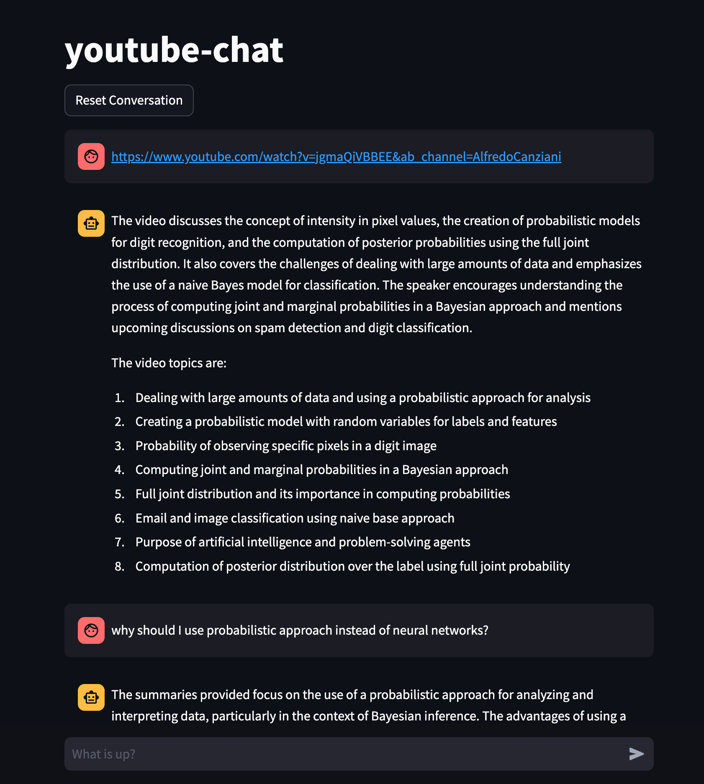

# YouTube-Chat

YouTube-Chat allows you to engage in interactive conversations with video content. Simply copy a YouTube video link, paste it into the chat, and within seconds, you can ask questions, summarize the content, and perform quick reviews of the video. This tool is particularly useful for engaging with lectures, podcasts, and other informative videos.

## Overview

The primary function of YouTube-Chat is to take a YouTube video link, retrieve its transcription, summarize the content, embed it, and store it in a vector database. The system then uses Retrieval-Augmented Generation (RAG) to answer user queries. We leverage the OpenAI API for its ease of use, though the code can be adapted to other language models.



## Setup and Usage

You can run this repository in two ways:
1. Using a Docker environment
2. Using Conda

Before starting, fill the `.env` file and add your OpenAI API key.

### Using Docker

1. **Build the container**:
   ```sh
   make build
   ```
   This command retrieves the token from the `.env` file.

2. **Run the container**:
   ```sh
   make run
   ```
   After running this command, open your browser and navigate to `localhost:7860`.

### Using Conda

1. **Create a Conda environment**:
   ```sh
   conda create -n wildgaussians python=3.10 -y
   ```

2. **Run the application**:
   ```sh
   streamlit run main.py --server.address 0.0.0.0 --server.port 7860
   ```

## File Structure

- **`main.py`**: This is the main entry point of the application. You can also specify the OpenAI model here. Currently, it uses `gpt-3.5-turbo-1106` as the baseline model.
- **`notebooks/00_parse_and_build_rag.ipynb`**: This Jupyter notebook is used for experiments and initial development.
